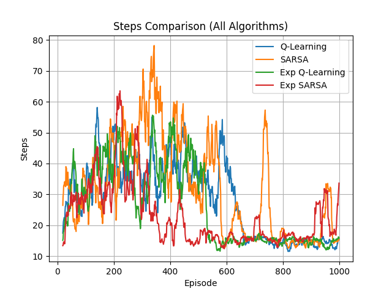
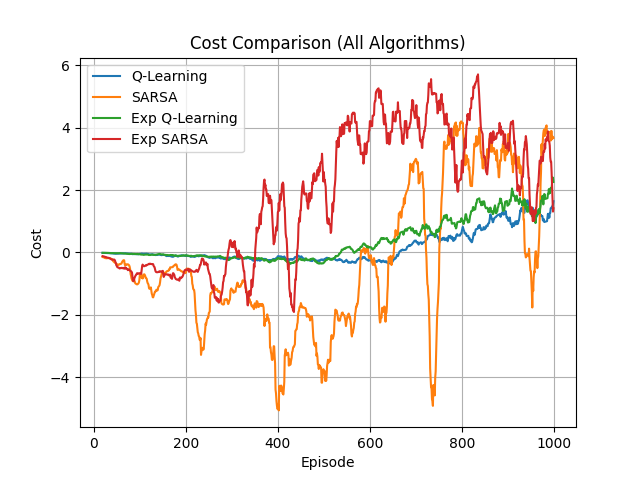

# Autonomous Robot Path Planning using Reinforcement Learning

This project presents an autonomous robotic navigation system using reinforcement learning algorithms—Q-Learning and SARSA—to solve path planning problems in a grid-based environment. The agent learns optimal navigation strategies through continuous interaction with the environment, aiming to minimize steps and maximize cumulative reward while avoiding obstacles.

---

## Overview

Path planning is a fundamental problem in robotics and artificial intelligence. This project demonstrates how reinforcement learning enables an agent to autonomously discover optimal paths through rewards and penalties. Over time, the agent improves its policy and converges toward efficient navigation.

---

## Methodology

### Environment

- Two-dimensional grid-based simulation  
- Static obstacles representing real-world constraints  
- Defined goal state  
- Reward structure:
  - Positive reward for reaching the goal  
  - Negative reward for hitting obstacles  
  - Neutral reward for valid movements  

---

### Algorithms

#### Q-Learning (Off-Policy)

- Learns optimal policy independent of current actions  
- Updates Q-values using maximum future reward  
- Faster convergence and higher efficiency  
- May produce aggressive paths  

#### SARSA (On-Policy)

- Learns based on actions actually taken  
- Updates Q-values using current policy  
- More stable and safer learning  
- Slower convergence compared to Q-Learning  

#### Experimental Variants

- Modified versions of Q-Learning and SARSA with parameter tuning  
- Used to analyze the impact of exploration rate and learning rate  
- Demonstrates how improper tuning affects stability and convergence  

---

## Results and Observations

- Progressive reduction in steps required to reach the goal  
- Increase in cumulative reward over training episodes  
- Q-Learning achieves faster convergence and lower final step count  
- SARSA demonstrates more conservative but stable learning  
- Experimental SARSA shows high reward but poor convergence stability  
- Clear trade-off observed between efficiency and safety  

---

## Performance Comparison

Evaluation metrics:

- Average steps per episode  
- Final convergence (last 50 episodes)  
- Variance (stability)  
- Average reward  
- Efficiency improvement (%)  

### Summary

| Algorithm        | Final Steps | Efficiency (%) | Stability |
|-----------------|------------|----------------|-----------|
| Q-Learning      | 14.08      | 48.19          | High      |
| SARSA           | 21.64      | 29.35          | Medium    |
| Exp Q-Learning  | 14.94      | 46.52          | High      |
| Exp SARSA       | 24.00      | -2.23          | Low       |

**Conclusion:**  
Q-Learning provides the best balance between convergence speed, efficiency, and stability. SARSA is safer but slower, while experimental SARSA highlights the importance of proper parameter tuning.

---

## Visualization

### Steps Comparison



### Cost Comparison



---

## Project Structure
` ` `
RL/
│
├── Q-Learning/
├── Sarsa/
├── RL_Q-Learning_E1/
├── RL_Sarsa_E1/
├── compare.py
├── steps_comparison.png
├── cost_comparison.png
` ` `

Each directory contains:

- Algorithm implementation  
- Training script (`run_agent.py`)  
- Generated results (CSV files and plots)  

---

## Usage

### Run Standard Q-Learning
```bash
cd Q-Learning
python run_agent.py
```
### Run Standard SARSA
```bash
cd Sarsa
python run_agent.py
```

### Run Experimental Q-Learning
```bash
cd RL_Q-Learning_E1
python run_agent.py
```

### Run Experimental SARSA
```bash
cd RL_Sarsa_E1
python run_agent.py
```

### Run Comparison
```bash
python compare.py
```

### Tech Stack
` ` `
Python
NumPy
Pandas
Matplotlib
Tkinter
Pillow
` ` `

### Applications
` ` `
Autonomous robot navigation
Path optimization in constrained environments
Game AI and simulations
Smart transportation and logistics
` ` `

### Author
Somiya Namdeo